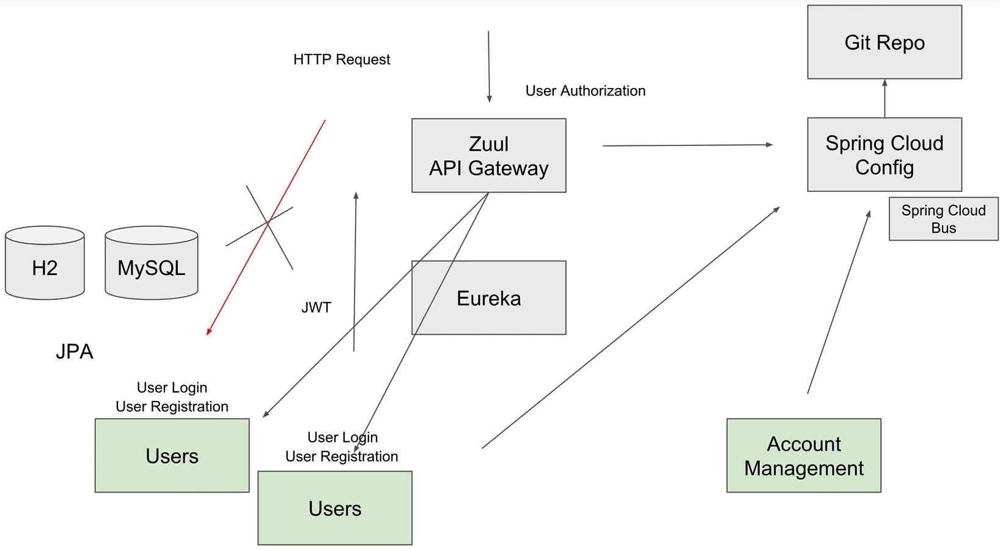
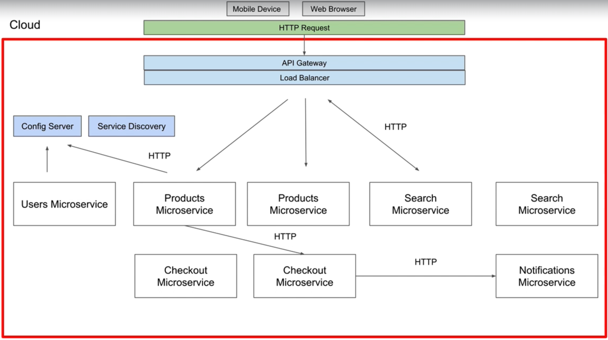
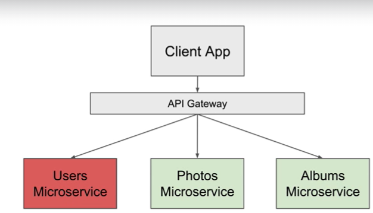
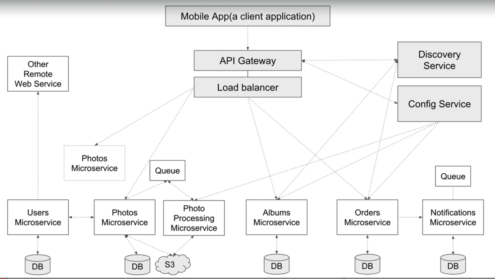
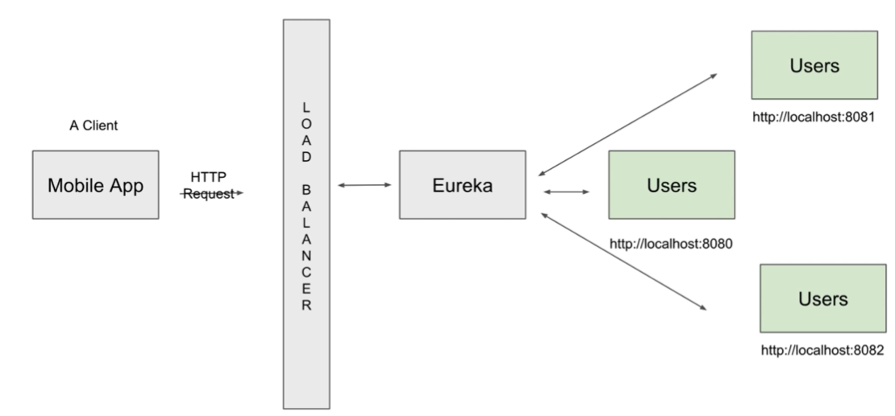
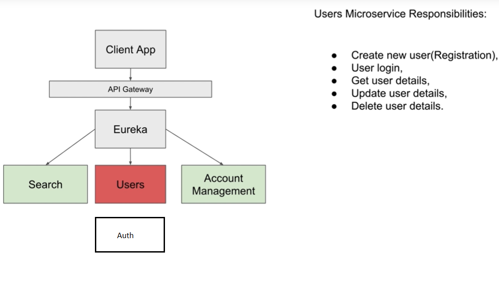
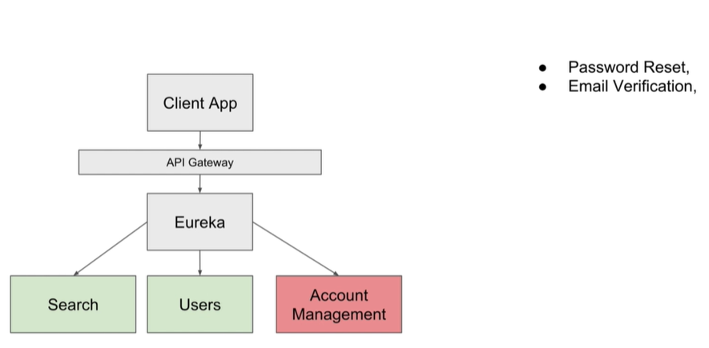
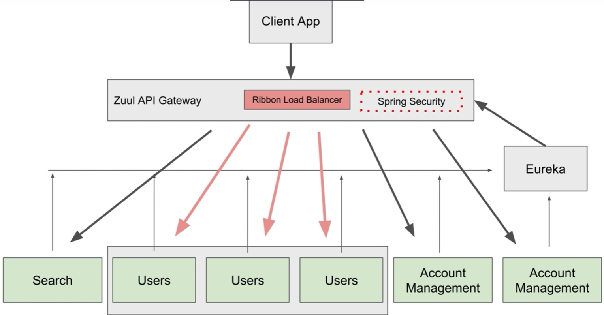
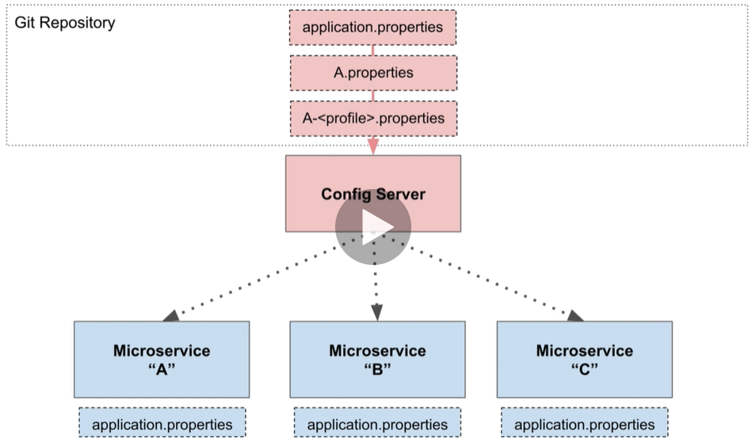
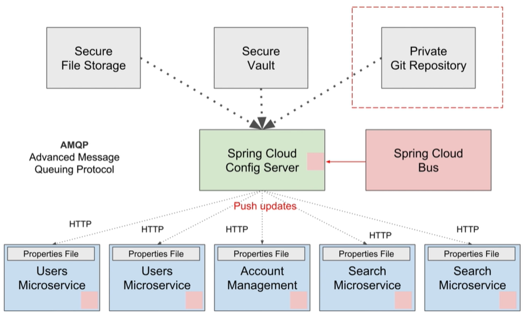

# SpringCloudVideoCourse

## Visão Geral

# Sample Microservices

## PhotoAppApiDiscoveryService

## PhotoAppApiUsers

## PhotoAppApiAccountManagement

## PhotoAppApiZuulAPIGateway

## PhotoAppApiConfigServer

## Exec new instance
mvn spring-boot:run -Dspring-boot.run.arguments=--spring.application.instance_id=nameService

## Spring Cloud Bus Rabbit 

https://medium.com/dev-cave/spring-cloud-config-48e423446ed8